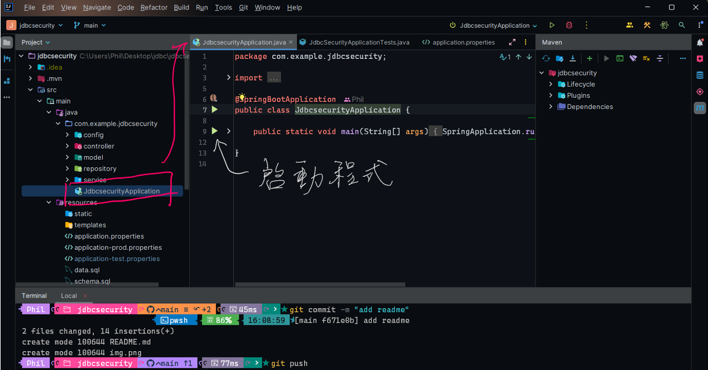
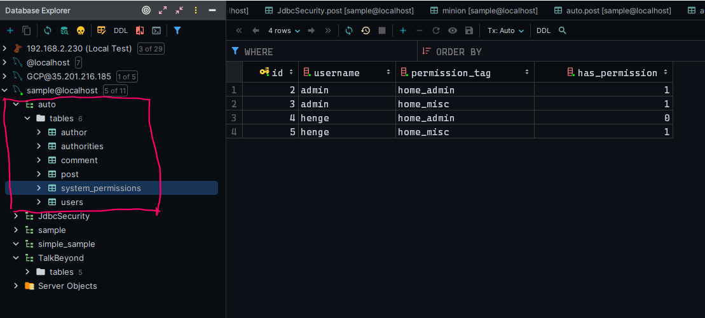
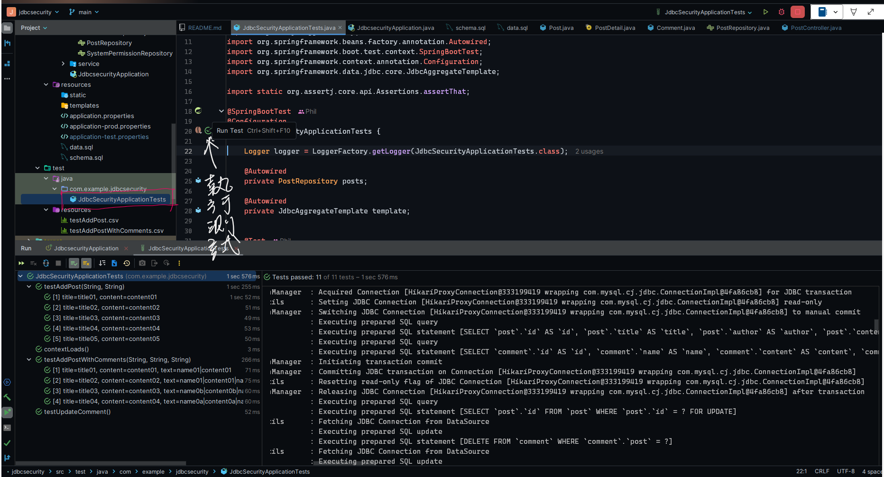

<div align="center">
  <br>
  <h1>Simple Java Training㊙️</h1>
  <strong>For HengeTech Community</strong>
</div>
<br>
<hr/>

#### 軟體版本

* Java: 17
* SpringBoot: 3.2
* MySQL: any

<hr/>

#### 架構
* Spring Web
* Spring Security
* Spring Data JDBC
* Spring Integration Test

<hr/>

#### Spring Data JDBC
* 功能介於 JDBC 與 Spring Data 之間
  * JDBC: 使用 SQL query, 回傳結果為簡單的 DataRow
  * Spring Data: 類似 .NET Entity Framework
  * Spring Data JDBC: 強調簡化 Spring Data, 主要是以 DDD (Domain Driven Desgin) 的需求來設計。
  * 參考說明: **[Spring Data JDBC](https://docs.spring.io/spring-data/jdbc/docs/3.1.7/reference/html/#repository-query-keywords)**

<hr/>
#### 執行步驟

* 打閞設定檔: src/main/resources/application-test.properties
```agsl
spring.datasource.url=jdbc:mysql://localhost/auto
spring.datasource.username=root
spring.datasource.password=henge
spring.sql.init.mode=always
logging.level.com.example.jdbcsecurity=TRACE
logging.level.org.springframework.jdbc=DEBUG
```
* 確認資料庫已存, i.e., auto, 同時 spring.sql.init.mode=always
* 執行主程式
<div style="margin:auto;width:80%">
    
</div>

* 執行後, 資料庫表格與資料應可建立完成, 產生資料的SQL檔: schema.sql, data.sql
<div style="margin:auto;width:80%">
    
</div>

* 打閞設定檔: src/main/resources/application-test.properties, 修改spring.sql.init.mode=never
```agsl
spring.datasource.url=jdbc:mysql://localhost/auto
spring.datasource.username=root
spring.datasource.password=henge
spring.sql.init.mode=never
logging.level.com.example.jdbcsecurity=TRACE
logging.level.org.springframework.jdbc=DEBUG
```
* 測試網站 
    * 使用者:
        1. username: admin, password: admin, role: admin
        1. username: henge, password: henge, role: user
    * 可用Url:
      1. http://localhost:8080/
      2. http://localhost:8080/admin
      3. http://localhost:8080/misc
      4. http://localhost:8080/login
      5. http://localhost:8080/logout
      6. http://localhost:8080/api/posts
      7. http://localhost:8080/api/posts/{1,2}
      8. http://localhost:8080/api/posts/{1,2}/detail
        

* 整合測試

<div style="margin:auto;width:80%">
    
</div>

